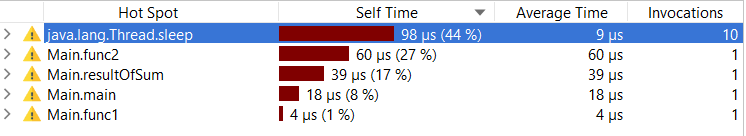

**Profiling**

In this practice we have to make profiling for already existed code.

I used jprofiler for this practice because the code for profiling was written on java. 
With help of it we can observe each function, and thread.
How many percent from whole time every function is executed. 

After run this cod with profiling we get something like that:

And now we are able to suggest and understand, what demands more or less time
for executing.

Thread.sleep(1);

- First of we can notice that Thread.sleep(1) demands the most of time.
Although thread sleeps only one millisecond, but it was called so much 
time and in small code like that it require a lot of processor's time.

- Than we have loop for in func2, which has to make 8 iterations and only than 
add two numbers and return sum. Also there ara two if, which will be executed 
while every iteration.

- Also there is function resultOfSum(int a, int b), which take two parameters 
and return there sum.

- Than we have loop for in func1, which include a lot of useless code like loop, 
which will be broke after first iteration.

- The main function which run the program and call func1().

**Conclusion**

My point of view that we are able to change this whole code with simple + for two elements.
